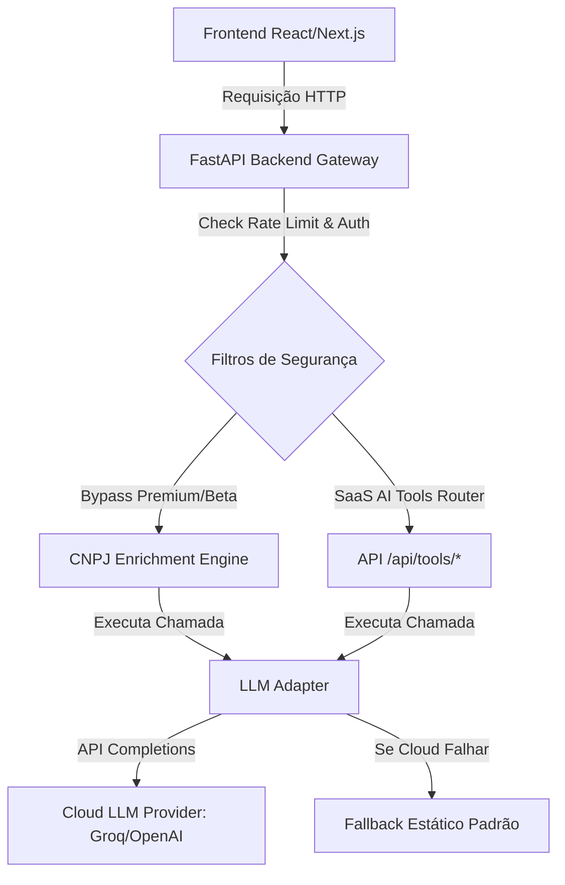

# 🛡️ Manual de Configuração e Segurança — Versão SaaS (LexGrid)

Este manual descreve a configuração, segurança e implantação da **Versão SaaS (`Lexgrid_Versao_SaaS`)** do LexGrid. Esta versão desacopla os motores locais de Inteligência Artificial (Ollama) e implementa uma arquitetura orientada a serviços na nuvem (Groq, OpenAI, Anthropic, etc.) via **LLM Adapter**, protegida por uma camada ativa anti-spam.

---

## 📐 1. Arquitetura de Integração de IA (SaaS)

A espinha dorsal de inteligência cognitiva do LexGrid foi migrada de um motor local *on-premise* para um modelo de microsserviços desacoplados na nuvem.



### Componentes Principais:
- **LLM Adapter:** [llm_adapter.py](file:///e:/documentos/projetos/LexGrid/backend/app/services/llm_adapter.py)
  Interface assíncrona que traduz as chamadas internas do LexGrid para o padrão de completions do chat da OpenAI, fornecendo suporte transparente para alteração de provedores (ex: de Groq para OpenAI) apenas alterando configurações de ambiente.
- **AI Tools Router:** [tools.py](file:///e:/documentos/projetos/LexGrid/backend/app/api/routers/tools.py)
  Endpoints independentes e serverless para consumo cognitivo externo.
- **Engine de SWOT e Pareceres:** [swot_builder.py](file:///e:/documentos/projetos/LexGrid/backend/app/engines/risk_engine/swot_builder.py)
  Consome o adaptador para gerar pareceres customizados em markdown com um mecanismo de fallback resiliente.

---

## ⚙️ 2. Configuração de Variáveis de Ambiente

Todas as chaves de integração devem ser declaradas no arquivo `.env` localizado na raiz do projeto (nunca expostas no código cliente ou repositórios públicos).

Adicione as seguintes linhas ao seu arquivo `.env`:

```bash
# Configurações de Inteligência Artificial (Adapter Cloud SaaS)
LLM_API_KEY=sua-chave-api-groq-ou-openai-aqui
LLM_BASE_URL=https://api.groq.com/openai/v1
LLM_MODEL=llama3-70b-8192
```

> [!IMPORTANT]
> - O `LLM_BASE_URL` padrão é configurado para a API do Groq, mas pode ser livremente alterado para o endpoint da OpenAI (`https://api.openai.com/v1`) ou qualquer outro proxy compatível.
> - O `LLM_MODEL` especificado deve existir no provedor selecionado.

---

## 🔒 3. Camada de Segurança Anti-Spam e Controle

A fim de proteger os servidores de custos explosivos na API da IA e garantir a estabilidade do sistema na fase gratuita de homologação (SaaS Beta), as rotas cognitivas possuem blindagem automática de segurança.

- **Escudo Anti-Spam:** [rate_limit.py](file:///e:/documentos/projetos/LexGrid/backend/app/core/security/rate_limit.py)
  Limita o consumo da IA a no máximo **15 requisições a cada 15 minutos por IP**.
  Se ultrapassado, o IP é bloqueado temporariamente retornando HTTP `429 Too Many Requests` com a resposta estruturada:
  ```json
  {
    "detail": "Para garantir a estabilidade do sistema em fase Beta, limite de análises atingido. Por favor, aguarde alguns minutos para gerar novos relatórios."
  }
  ```
- **Bypass de Acesso Beta:**
  Os usuários validados através de uma chave de homologação (Beta Access Token) recebem passe livre para testes (`request.state.is_premium = True`), substituindo futuras barreiras de pagamento obrigatórias nas ferramentas cognitivas.

---

## 🚀 4. Catálogo de Endpoints de IA (SaaS Tools)

As seguintes ferramentas serverless estão disponíveis para consumo sob o prefixo `/api/tools/*`:

### 1. `POST /api/tools/analyze-risk`
Recebe dados cadastrais e de chassi de risco de um CNPJ e retorna um Score de Risco Global (0 a 100), nível de criticidade e justificativa analítica.

### 2. `POST /api/tools/generate-swot`
Classifica cenários corporativos gerando a Matriz SWOT clássica contendo Forças, Fraquezas, Oportunidades e Ameaças.
* **Corpo da Requisição:**
  ```json
  {
    "cnpjData": {
      "razao_social": "LexGrid Software S/A",
      "capital_social": 1200000.0,
      "uf": "AM"
    },
    "riscosMapeados": {
      "dividas": 150000.00,
      "protestos": 2
    }
  }
  ```
* **Resposta Esperada (JSON):**
  ```json
  {
    "success": true,
    "data": {
      "forces": ["Forte estrutura de capital social declarado.", "Regularidade cadastral estabelecida no estado do AM."],
      "weaknesses": ["Débito ativo relevante perante a União.", "Existência de títulos protestados ativos."],
      "opportunities": ["Elegibilidade para incentivos de inovação (CAPDA/SUFRAMA)."],
      "threats": ["Risco de execução fiscal sobre receitas operacionais."]
    }
  }
  ```

### 3. `POST /api/tools/extract-ncm`
Varre textos brutos ou notas fiscais desestruturadas e extrai semântica de produtos associando-os com seu respectivo código NCM de 8 dígitos.

---

## 🖥️ 5. Exemplo de Consumo no Frontend (React/Vue)

Para acionar a geração da SWOT diretamente a partir do painel do cliente, utilize o padrão assíncrono de consumo abaixo:

```javascript
async function handleGerarSwot() {
    setLoading(true);
    try {
        const res = await fetch('/api/tools/generate-swot', {
            method: 'POST',
            headers: { 'Content-Type': 'application/json' },
            body: JSON.stringify({
                cnpjData: cliente.dadosCadastrais,
                riscosMapeados: cliente.riscos
            })
        });
        const json = await res.json();
        if (json.success) {
            setSwotDashboard(json.data); // Atualiza o dashboard com forces, weaknesses, opportunities, threats
        }
    } catch (error) {
        alert("Erro ao processar análise inteligente.");
    } finally {
        setLoading(false);
    }
}
```

---

## 🧪 6. Roteiro de Teste e Homologação

Para certificar que todos os bancos de dados e o adaptador de IA estão totalmente operacionais no ambiente de homologação:

1. **Ative o Ambiente Virtual do Python:**
   ```bash
   # Windows PowerShell
   .\.venv\Scripts\activate
   ```
2. **Execute a Suíte de Qualidade Estática:**
   ```bash
   python scripts/quality/run_quality_pipeline.py
   ```
   *Deve retornar `=== QUALIDADE APROVADA ===`*
3. **Execute os Smoke Tests Físicos:**
   ```bash
   python backend/test_db.py
   ```
   *Deve validar conexão positiva com PostgreSQL, Dragonfly, Qdrant e LLM Cloud (4/4 funcionais).*
4. **Validação E2E Local via PowerShell (Chamada SWOT):**
   ```powershell
   Invoke-RestMethod -Method Post -Uri "http://localhost:8003/api/tools/generate-swot" -ContentType "application/json" -Body '{"cnpjData": {"razao_social": "LexGrid"}, "riscosMapeados": {}}'
   ```
